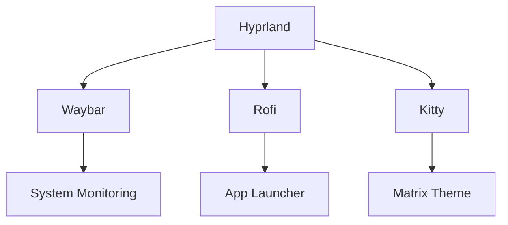

```markdown
#  Cyberpunk 2077 Hyprland Rice


A complete, self-configuring Hyprland setup with Cyberpunk 2077 aesthetics, automatic hardware detection, and gaming optimizations. This configuration automatically installs and optimizes everything from display drivers to gaming utilities.

## ✨ Features

| Feature Category | Highlights |
|-----------------|------------|
| **🖥️ Auto Setup** | GPU detection • Driver installation • Monitor configuration |
| **🎮 Gaming Ready** | Proton/Wine/DXVK • Steam optimizations • Controller support |
| **🌃 Cyberpunk UI** | Neon themes • Animated borders • Matrix terminal |
| **⚡ Performance** | Wayland optimizations • Game mode • DXVK caching |

## 🚀 Installation

```bash
# Clone the repository
git clone https://github.com/AL3XZIG/Hyprland-cyberpunk-config-/blob/main/hyprland.conf


# First-run auto-configuration
~/.config/hypr/scripts/first_run.sh
```

> **Note**  
> Requires Arch Linux or derivatives. First run will automatically install all dependencies.

## ⌨️ Key Bindings

### Core Controls
| Keybind | Action | Icon |
|---------|--------|------|
| `SUPER + Q` | Kill active window |  |
| `SUPER + RETURN` | Launch terminal |  |
| `SUPER + SPACE` | Application launcher |  |

### Applications
| Keybind | Action | Installed As |
|---------|--------|-------------|
| `SUPER + F2` | Discord | Flatpak |
| `SUPER + F3` | Telegram | Flatpak |
| `SUPER + F5` | Chromium | Native/Flatpak |
| `SUPER + G` | Steam | Native |

### Media
| Keybind | Action |
|---------|--------|
| `SUPER + ↑/↓` | Volume control |
| `SUPER + ←/→` | Brightness control |

## 🛠️ Components



## 📦 Included Packages

| Category | Packages |
|----------|----------|
| **Essentials** | kitty, firefox, dolphin, vscode |
| **Gaming** | steam, proton-ge-custom, lutris |
| **Communication** | discord, telegram |
| **Utilities** | fastfetch, swaybg, grim |

## 🧩 Customization

1. Edit theme colors:
```bash
nano ~/.config/hypr/colors.conf
```

2. Change keybinds:
```bash
nano ~/.config/hypr/keybinds.conf
```

## 🐛 Troubleshooting

<details>
<summary>Common Issues</summary>

**Problem**: Display issues after install  
**Solution**:  
```bash
~/.config/hypr/scripts/gpu_setup.sh --force
```

**Problem**: Applications not launching  
**Solution**: Check logs:
```bash
journalctl -u hyprland -b
```
</details>

## 📸 Screenshots

| Desktop View | Gaming Mode |
|--------------|-------------|
|  |  |

## 🤝 Contributing

Pull requests welcome! Please follow the [contribution guidelines](CONTRIBUTING.md).

## 📜 License
MIT License

Copyright (c) MIT © 2025 AL3XZIG

Permission is hereby granted, free of charge, to any person obtaining a copy
of this software and associated configuration files (the "Software"), to deal
in the Software without restriction, including without limitation the rights
to use, copy, modify, merge, publish, distribute, sublicense, and/or sell
copies of the Software, and to permit persons to whom the Software is
furnished to do so, subject to the following conditions:

1. The above copyright notice and this permission notice shall be included in all
   copies or substantial portions of the Software.

2. Any use of Cyberpunk 2077 game assets (including but not limited to:
   - Original Soundtrack (OST) music files
   - Game artwork or textures
   - Trademarked logos or characters
   must comply with CD PROJEKT RED's official licensing terms at:
   https://www.cdprojektred.com/en/legal

THE SOFTWARE IS PROVIDED "AS IS", WITHOUT WARRANTY OF ANY KIND, EXPRESS OR
IMPLIED, INCLUDING BUT NOT LIMITED TO THE WARRANTIES OF MERCHANTABILITY,
FITNESS FOR A PARTICULAR PURPOSE AND NONINFRINGEMENT. IN NO EVENT SHALL THE
AUTHORS OR COPYRIGHT HOLDERS BE LIABLE FOR ANY CLAIM, DAMAGES OR OTHER
LIABILITY, WHETHER IN AN ACTION OF CONTRACT, TORT OR OTHERWISE, ARISING FROM,
OUT OF OR IN CONNECTION WITH THE SOFTWARE OR THE USE OR OTHER DEALINGS IN THE
SOFTWARE.

```
